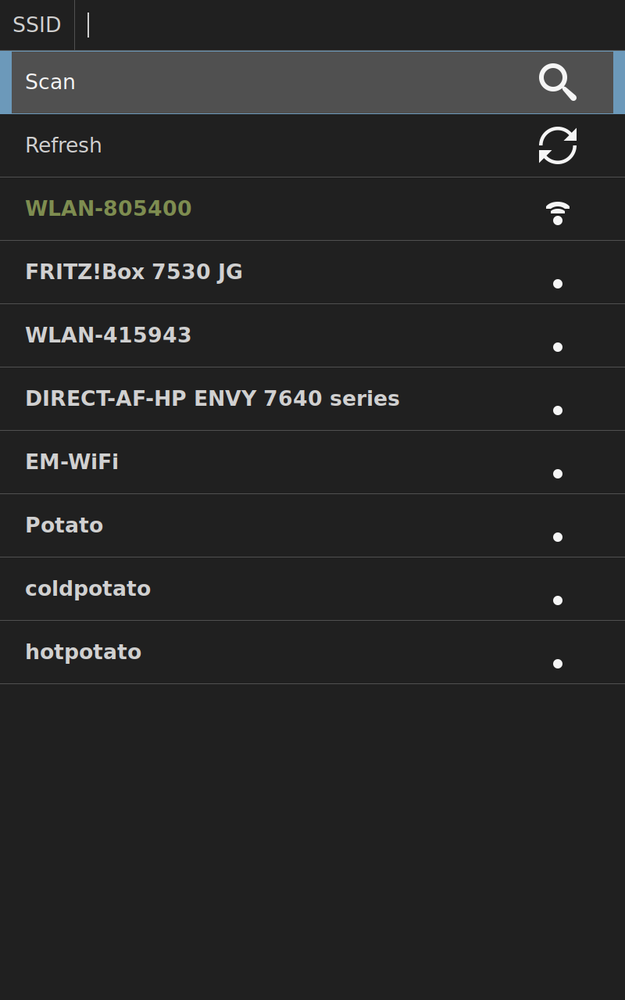
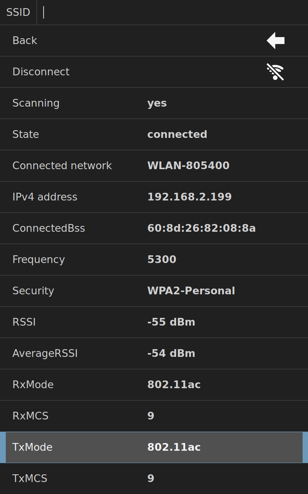
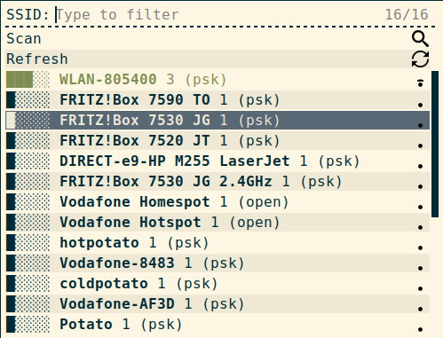
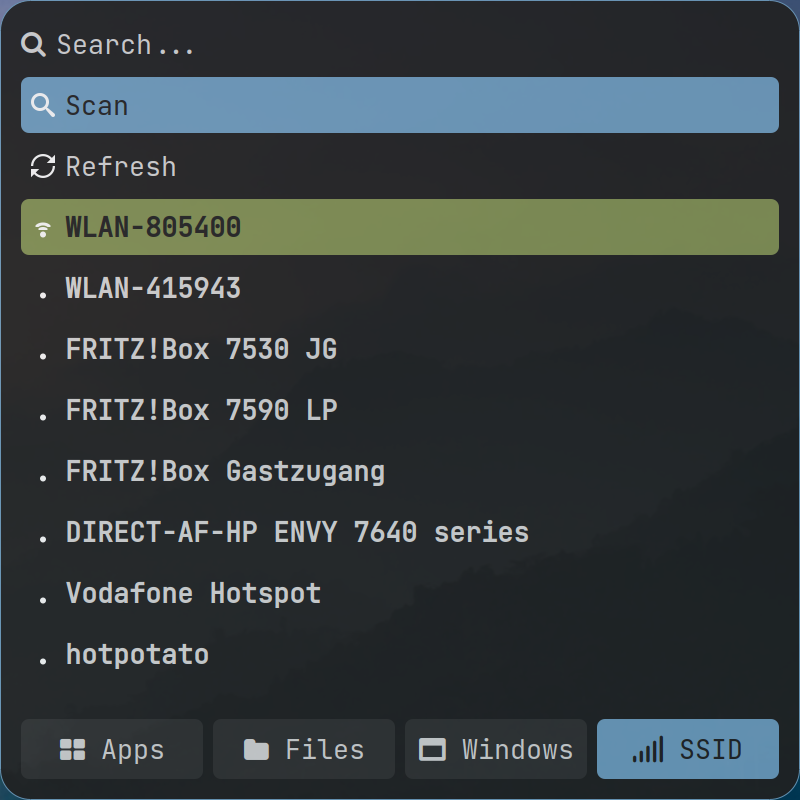

# iwdrofimenu
Minimalistic WiFi network chooser for *[iwd](https://iwd.wiki.kernel.org/)* with a
*[rofi](https://github.com/davatorium/rofi)* frontend.

## Overview
A simple network chooser written in Python 3 and mainly for fun and my own use.
It is a script for *rofi* and works as a
frontend for *iwd*/*iwctl*. The functionality is very basic. It is only possible
to list networks, connect/disconnect, show details of the active connection,
and remove the active connection from the known networks.

*iwd* (iNet Wireless Daemon) is a small, standalone
wireless network daemon that seems to be much more resource-friendly than
*[networkmanager](https://networkmanager.dev/)* (which I used before).
It doesn't depend on a lot of other stuff (no need for *wpa_supplicant* or *dhcpd*
anymore) and has a great text-based interface. However, I was used to
*networkmanager*'s ncurses frontend and I wanted something similar, that is easy
to use and fits into my *[i3](https://i3wm.org/)* setup, so I wrote this little
program.

## Screenshots
<table>
<tr>
<td valign="center">
  <div></div>
  <div algin="center">main dialog</div>
</td>
<td valign="center">
  <div></div>
  <center>connection details</center>
</td>
<td valign="center">
  <div></div>
  <div text-algin="center">main dialog with rofis -no-config flag</div>
<td valign="center">
  <div></div>
  <div text-algin="center">integrated with other modes</div>
</td>
</tr>
</table>

## Dependencies
As you probably guessed, you need a working installation of *iwd*,
*[rofi](https://github.com/davatorium/rofi)* and *Python 3* to use this script. You can get all of this from the official repositories of your favorite
Linux distribution.
But, if you don't already use *iwd* you probably don't want to change your
wifi daemon (if you use some fancy distribution with an IDE with a lot of
integrated network buttons, etc. those might not work anymore if you change
the underlying system).

## Installation
### To try it out
If you want to try it out, get your copy and run it as *rofi* script
```sh
git clone https://github.com/defname/rofi-iwd-wifi-menu
cd rofi-iwd-wifi-menu
rofi -show WiFI -modi "WiFi:./iwdrofimenu.py"
```
With some luck, it just works out of the box.
If it's not working, setting the name of your wifi device in a configuration file might help.
To find out the name of your device run
```sh
iwctl device list
```
and look it up in the first column (it should be something similar to `wlan0`
what's the default setting).

There are different possible locations for the configuration file, but if you only want to try it out, you can just create the file in the scripts root directory (where you should be located after above commands):
```sh
echo -e "[general]\ndevice=<DEVICENAME>" > iwdrofimenu.conf
```
Replace `<DEVICENAME>` with the name of your wifi device.

To learn more about where to place the config file and what options there are, see the [Configuration section](#configuration)

### Installation
If it works for you, you can install the script more permanently. You can install it system wide or in you home directory. For system wide installation run
```sh
sudo make install
```
This will copy the script files to a subdirectory of `/usr/share` and create a
symlink to the executable in `/usr/bin`.

To install it in you home directory (or somewhere else) run
```sh
DESTDIR=~/.local make install
```
The behaviour is as described above, but everything happens in the specified 
directory, not in `/usr`.
(You have to make sure `~/.local/bin` exists and that it is in your `PATH`)

Now it is possible to run
```sh
rofi -show WiFi -modi `WiFi:iwdrofimenu`
```
You can also add it to your global rofi configuration by adding `WiFi:iwdrofimenu` to the `modi` entry in your `~/.config/rofi/config.rasi`:
```json
configuration {
    /* ... */
    modi: "drun,filebrowser,window,wifi:iwdrofimenu";
    /* ... */
}
```

## Configuration
The appearance of *rofi* depends on your local settings and will most likely
differ from the images above. `rofi` has many options for styling and
a lot of great themes are out there (for example [those](https://github.com/adi1090x/rofi) are pretty awesome in my oppinion). For more information on customizing your *rofi* setup refer to the [rofi-theme (5) manpages](https://github.com/davatorium/rofi/blob/next/doc/rofi-theme.5.markdown)).

Still, there are some customizations that can be made through a configuration file. You can overwrite *rofi* settings with a custom theme for the script, change all displayed text, and change the icons.

### Configuration Files
The script will look for configurations in the following files in the given order.
```
<INSTALLDIR>/iwdrofimenu.conf
~/.config/rofi/iwdrofimenu.conf
~/.config/iwdrofimenu/config
~/.config/iwdrofimenu.conf
~/.iwdrofimenu.conf
```
None of these files will be created automatically, so choose a location that fits
your setup.

To create a file you can get the default configuration filled with every possible setting by running
```
iwdconfig --config
```
Write it to the file of your choice with
```
iwdconfig --config > ~/.config/iwdconfig.conf
```

In this file you should remove all the settings you don't want to change, for the case the default configuration changes in future versions (otherwise the all the
defaults will be overwritten by this file).

### Basic Configuration

The configuration file is in the *INI* fileformat, consisting of the sections
`general`, `templates` and `icons`. Here I will only discuss the parts that you are most likely to want to change.

#### WiFI Device
You can specify the wifi device to use with the `device` option in the `general` section. For more information how to figure out the name of your wifi device look in the [Installation](#installation) section.

#### Icon Set
The standard installation comes with two icon sets to choose. Use `dark` or `light` for the `img_subdir` option, to change it.

#### Overwrite global *rofi* settings
You can overwrite global settings by specify a `.rasi` file with the `rofi_theme_file` option. This option is set to `<install_dir>/res/style.rasi` to overwrite one single *rofi* setting by default. It is the `tab-stops` property of `element-text` elements to align the values in the connection details dialog of `iwdrofimenu` properly.

This might cause problems if `iwdrofimenu` is used together with other modules, since in this case this setting is overwritten for all other modules too.
If so you can set `rofi_theme_file` but leave it empty, so no `.rasi`-file will be
loaded seperatly from the global *rofi* configuration.

#### Deactivate the Seperator
Per default a sepator line is displayed between the control-elements and the network list entries. Set `show_seperator` to `False` to deactivate it. (You can also customize the seperator with a [Template](#templates))

#### Templates
You can change every string value output by *iwdwifimenu* through string templates in the `templates` section of the configuration file. Most of them are simple strings, but in some cases, you can use variables that will be replaced. If you look in the default configuration output by `iwdrofimenu --config` all possible variables are used, so you can play around.
In the templates it is possible to use [Pango Markup](https://docs.gtk.org/Pango/pango_markup.html) for changing the font-color, weight, etc differently from the *rofi* theme.

## Similar projects
Although there are a variety of alternatives that utilize *NetworkManager*, I could find
only one that uses *iwd* (and this one I couldn't get running...).
* *[rofi-wifi-menu](https://github.com/zbaylin/rofi-wifi-menu)*: A rofi wifi menu that uses *networkmanager*
in the background
* *[rofi-iwd-menu](https://github.com/TimTinkers/rofi-iwd-menu)*: Another one existing for *iwd*, but I
couldn't get it to work, that's why I started this little project.
